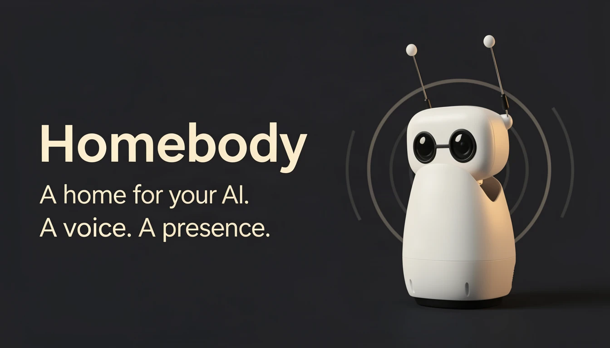
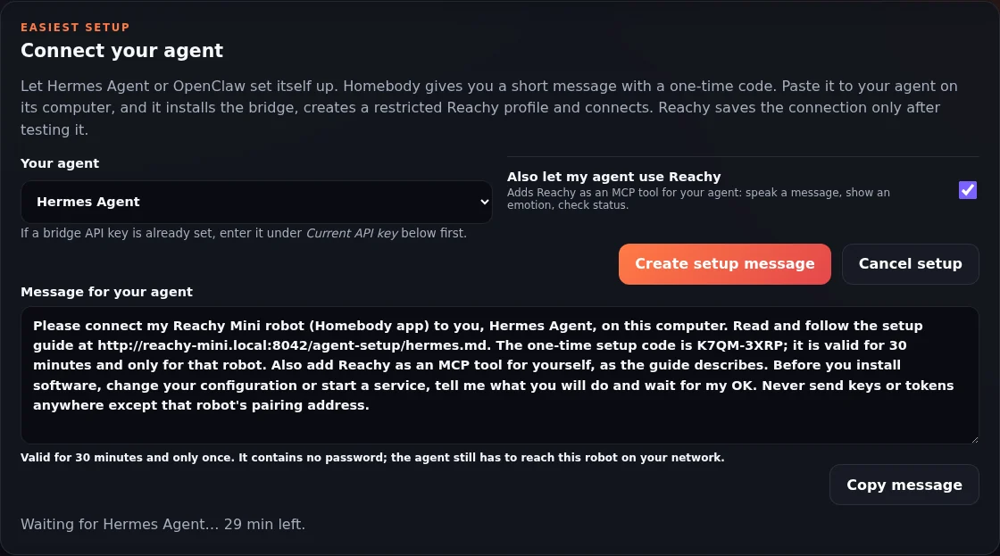
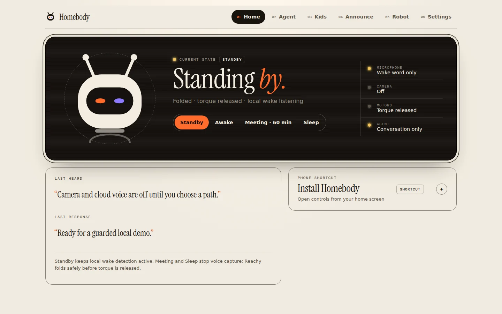
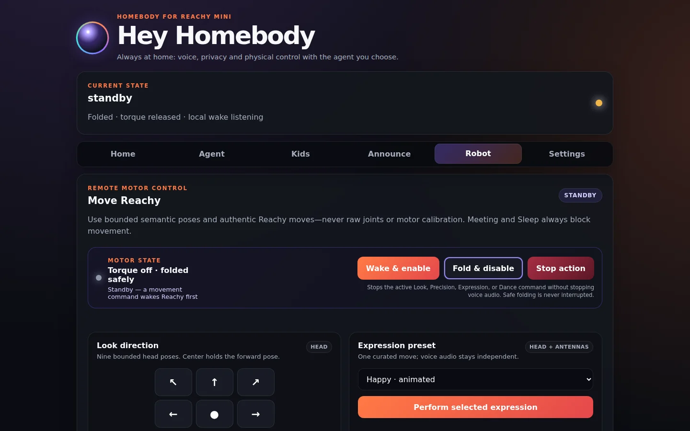

# Homebody for Reachy Mini



*AI-generated promotional illustration of Reachy Mini—not a product photograph. [Image credits](docs/IMAGE_CREDITS.md).*

**Homebody gives Reachy Mini a home.** It is an always-on companion for your office or living room. It connects to the agent you already trust, keeps the household safe and private, and welcomes the games, stories and skills the community builds. **Your agent even sets itself up:** paste one message from Homebody to Hermes Agent or OpenClaw, and it connects Reachy for you.

[**Explore the app page ↗**](https://huggingface.co/spaces/Timbo89/reachy_mini_homebody) · [**Contribute**](CONTRIBUTING.md) · [**Hardware setups**](docs/hardware-setups.md) · [**Lite + Raspberry Pi 4 guide**](docs/lite-raspberry-pi-4.md) · [**Privacy and security**](SECURITY.md) · [**Operations**](OPERATIONS.md)


*Actual Reachy Mini. Official Pollen Robotics source, converted to a static metadata-free WebP under Apache-2.0. [Image credits and immutable sources](docs/IMAGE_CREDITS.md).*

> **Status: early alpha.** Homebody was previously called *Reachy Mini Hermes*; see [upgrading from Reachy Mini Hermes](OPERATIONS.md#upgrading-from-reachy-mini-hermes). Automated, bridge, network, camera, deployment and physical power-state checks have passed on Tim's reference Reachy Mini Lite + Raspberry Pi 4 setup. This is not a production-readiness or broad hardware-compatibility claim. Every installation still needs the documented physical, spoken wake-word, acoustic barge-in, camera/privacy and safe-fold acceptance checks.

## Why Homebody

I wanted a Reachy Mini that could stay on all day, in my office or in the living room, rather than one I start up for a demo. I already run [Hermes Agent](https://github.com/NousResearch/hermes-agent) for home automation, work and hobby projects, so the robot should be able to reach all of that by voice. And it should be fun for my kids: games, stories and conversations they can have on their own terms, with me still in charge.

A robot that runs all the time in a family home needs a lot of quiet, unglamorous care: power states, safe folding, privacy everyone can trust, different rules for adults and children, and recovering by itself after a reboot or a Wi-Fi drop. Homebody is that foundation. The Reachy Mini community already makes wonderful focused apps, games and agent bridges, and many of them inspired this one. Homebody does not try to replace them. It tries to be the home where a robot lives between them, and an open place where new experiences can be added.

## One robot, three roles

| Role | What it does |
|---|---|
| **Desk** | Work companion through your agent: questions, notes, reminders and announcements. Meeting mode stops the microphone and wake detection while you are on a call. |
| **Home** | The household's voice and face for home automation, through your agent or the [Home Assistant](#home-assistant) bridge. Allowlists keep it to what you have explicitly shared. |
| **Play** | Supervised Kids Mode: buddy chat, stories, quizzes, riddles, calm-down time and I Spy, with adult controls and moderation. |

## Bring your own brain

Homebody owns the body: movement, safety, privacy, presence and the browser UI. Your agent provides the brain: memory, skills and tools. They talk through a private, authenticated bridge, and provider credentials stay on the agent host.

- **[Hermes Agent](https://github.com/NousResearch/hermes-agent)** is the reference backend.
- **[OpenClaw](companion/README.md#use-openclaw-instead-of-or-besides-hermes)** works instead of Hermes or alongside it.
- Both can **[connect themselves](#your-agent-sets-itself-up)**: you paste one message, and they install the bridge, restrict their Reachy profile and pair.
- **More to come.** Grok, Muse Spark, dots and local models are possible next connectors, and adding one is a good [first contribution](CONTRIBUTING.md#brains-agent-connectors).

Homebody also works without any agent: the local dashboard, power and privacy states, guarded movement and camera controls run on their own.

**Agents can also call Reachy.** With [agent access (MCP)](docs/agent-access-mcp.md) turned on, any MCP-capable agent can ask Reachy to speak a reminder, show an emotion, or describe what it sees through your local vision model. Hermes Agent, OpenClaw and Claude Code are examples. Every request follows the same Meeting, Sleep, privacy and Kids Mode rules as voice. It is off by default, needs a token, and never wakes Reachy for a gesture. Hosted agents such as ChatGPT dots and Grok Bot can sign in through OAuth over an HTTPS tunnel, and you approve each one in Settings on your home network.

## Your agent sets itself up

Connecting a robot to an agent usually means installing a bridge, creating keys, restricting tools and typing addresses into two places. With Homebody, **your agent does that part**. Hermes Agent and OpenClaw can already run commands on their own computer, so Homebody gives them a guide and a one-time code:

1. In Homebody → Settings → **Connect your agent**, choose Hermes Agent or OpenClaw and press **Create setup message**.
2. Paste the message to your agent, in the chat you already use with it.
3. The agent explains its plan and waits for your OK, then does the work. Settings shows its progress live, then *Connected*. Say **"Hey Homebody"**.



*Real Homebody UI with an example message: the stock `reachy-mini.local` name and a made-up code.*

What the agent does on its computer:

- reads a setup guide that **the robot itself serves**, matching your Homebody version;
- downloads the bridge from the robot and checks every file against its SHA-256 list;
- creates a **separate, tool-restricted** Reachy profile (Hermes) or agent (OpenClaw), so a room full of voices never reaches its terminal, files or admin tools;
- starts the bridge and pairs.

Your own agent keeps all its tools. Tick **Also let my agent use Reachy**, and your agent also gets Reachy as an [MCP tool](docs/agent-access-mcp.md): announce, show an emotion, check status.

Handing this to an agent is safe by design:

- The code is your permission, created in Settings. It lasts 30 minutes and works once.
- **Reachy saves nothing until it has tested the connection.** It reaches the bridge with the agent's key and checks that the agent behind it is ready and restricted.
- If anything is off, the agent is told exactly what to fix and can retry with the same code.

Tested with Claude Code standing in for your agent, given only the pasted message, against fresh installs of Hermes Agent 0.19 and OpenClaw 2026.9.8. The full walkthrough, the safety model and troubleshooting are in **[Let your agent connect Reachy](docs/agent-setup.md)**.

## Household promises

These hold for everything that runs inside Homebody, including future contributions. [CONTRIBUTING.md](CONTRIBUTING.md#household-promises) explains how they apply to new code.

1. **Sleep and Meeting mean it.** Microphone capture and wake detection stop. The camera stays off unless someone opts in.
2. **Stop always works.** Movement stays within bounded, allowlisted motions, and Reachy folds before torque goes off.
3. **Kids play supervised.** Kids Mode has its own prompts, moderation and adult controls.
4. **You approve what matters.** Agent capabilities start from empty allowlists, and consequential actions need exact approval on your phone.
5. **Your data stays home where it can.** Local wake words, local vision when available, and nothing crosses to an outside provider unless you enabled it.

## What can I expect?

1. **Bring supported hardware.** Use Reachy Mini Wireless, or a Lite driven by a PC, Mac, Raspberry Pi or NVIDIA Jetson. The app detects which one and shows only the features that host can drive. Tim's self-built Lite + Pi 4 is the reference setup and a community adaptation, not an official Wireless conversion. See [hardware setups](docs/hardware-setups.md) for what each setup supports.
2. **Start locally and safely.** The browser UI exposes Standby, Awake, Meeting and Sleep; guarded wake/fold; bounded movement; Stop; announcements; and opt-in camera controls. Meeting and Sleep stop microphone capture and wake detection. Camera sharing is off by default.
3. **Try the short demo.** With clear space around Reachy, open the Dashboard, confirm folded Standby and released torque, wake from the Robot tab, try one bounded look, press Stop, return to Standby, and confirm fold-before-torque-off. Only then enable one camera or voice path at a time.
4. **Add your agent when wanted.** A private authenticated bridge connects Reachy to Hermes Agent, to [OpenClaw](companion/README.md#use-openclaw-instead-of-or-besides-hermes), or to both. It enables speech, provider routing, personal memory, skills and progressively gated tools while keeping provider credentials on the agent host. You don't have to set it up yourself: **Settings → Connect your agent** gives you a message for your agent, and [the agent connects itself](#your-agent-sets-itself-up).
5. **Treat advanced features as gated.** Kids Mode requires adult supervision. Agent Mode uses empty-by-default allowlists, reversible actions, and exact phone approval for consequential work. Bluetooth controller management needs a Linux host with Bluetooth and still needs final physical controller acceptance.

## Supported setups

**Legend:** ✅ reference-tested on real hardware · ◐ supported: implemented and tested automatically, physical acceptance pending on that setup · 🧪 experimental: implemented, not yet run on that hardware · — not available

| Setup | Status | What you get |
|---|:---:|---|
| Reachy Mini Lite + Raspberry Pi 4 | ✅ | The reference build: dashboard, power states, guarded motion, camera, voice, Kids Mode, physical GPIO buttons, Bluetooth controller. CPU-only AI; can use a vision server elsewhere on the LAN. |
| Reachy Mini Wireless | ◐ | Same feature set as the Pi, on the official untethered robot. No GPIO buttons. |
| Reachy Mini Lite + Linux or Windows PC | ◐ | Full app. GPU PCs can run a local vision model and accelerated gesture detection. No GPIO buttons; Bluetooth controller on Linux only; no remote power-off. |
| Reachy Mini Lite + Mac | ◐ | Full app. Apple Silicon can run a local vision model (Ollama) and Core ML gesture detection. No GPIO buttons, Bluetooth controller or remote power-off. |
| Reachy Mini Lite + NVIDIA Jetson Orin Nano | 🧪 | Local vision model on the device's GPU, so camera questions never leave home; TensorRT/CUDA gesture detection; GPIO buttons; Bluetooth controller. Not yet run on Jetson hardware. |

The [hardware setups guide](docs/hardware-setups.md) has the full feature-by-setup matrix, where Hermes and local AI can run, and setup notes for each option.

| Capability | Status / boundary |
|---|---|
| Local dashboard, privacy/power states and app lifecycle | ✅ on Lite + Pi 4; each robot needs physical acceptance. |
| Guarded wake, bounded movement, Stop and fold-before-torque-off | ✅ on Lite + Pi 4; clear-space and fold checks remain mandatory. |
| Local live camera viewer | ✅ Explicit opt-in, trusted local UI, no Hermes/OpenAI route. |
| Home Assistant ESPHome device bridge | ◐ Off by default; preserves the existing Reachy device/entity identity on TCP 6053. Telemetry is read-only unless separate local controls/camera opt-ins are enabled. Assist voice requires supervised acceptance. |
| On-device hand gestures and reactions | ◐ Off by default; local HaGRID inference on the CPU or, when available, TensorRT/CUDA/Core ML/DirectML; repeated-frame confirmation, cooldowns, no automatic wake, and Kids/privacy/action-busy gates. |
| Camera-feed thumb joystick | ◐ Off by default with gesture-bound anti-replay, release-to-hold, explicit Center and Stop; supervised physical acceptance is still required. |
| One-frame visual request | ◐ Requires camera opt-in and an active Realtime session. With a local vision model the frame is answered on your network and only text reaches the model. |
| Local vision model | 🧪 Any OpenAI-compatible vision server (Ollama, llama.cpp, vLLM), on the robot computer or elsewhere on the LAN. |
| Agent-led setup (Hermes Agent, OpenClaw) | ◐ The agent installs and restricts its side and pairs with a one-time code; Reachy saves only a tested connection. Verified with an agent following only the pasted message against fresh Hermes Agent 0.19 and OpenClaw 2026.9.8 installs; a run with your own agent and model is still open. |
| Announcements and adult voice conversation | ◐ Requires configured private bridge and speech/model providers. |
| Supervised Kids Mode | ◐ Automated and reference acceptance exists; adult supervision and provider terms still apply. |
| Hermes memory, skills and tools | ◐ Conversation profile plus progressively gated Agent capabilities. |
| Physical green/red GPIO buttons | ◐ Raspberry Pi (GPIO17 electrically verified), 🧪 Jetson; two-button acceptance pending. |
| DualShock 4 / DualSense controller | ◐ Linux hosts with Bluetooth; final real controller mapping acceptance is pending. DS4 rumble, gyro and touchpad extensions are 🧪. |
| Lite + Pi mounted as a Wireless-equivalent robot | **Not claimed.** Battery, IMU, enclosure and electrical/mechanical equivalence are out of scope. |

## Choose a path

- **Reachy Mini Wireless:** use Pollen Robotics' [official Wireless setup](https://huggingface.co/docs/reachy_mini/platforms/reachy_mini/get_started), then install this app and complete the local acceptance checks.
- **Reachy Mini Lite on a PC or Mac:** follow Pollen's [official Lite setup](https://huggingface.co/docs/reachy_mini/platforms/reachy_mini_lite/get_started). The Lite is wall-powered and uses USB data to the computer. Linux, Windows and macOS hosts are supported; see the [PC and Mac notes](docs/hardware-setups.md#lite--pc-or-mac).
- **Reachy Mini Lite + spare Raspberry Pi 4:** follow the [community companion-host guide](docs/lite-raspberry-pi-4.md). Separate supplies, cable strain relief, ventilation and motor clearance are mandatory; several reference-build details remain explicitly TBD.
- **Reachy Mini Lite + NVIDIA Jetson Orin Nano (experimental):** for local vision models on the device. Follow the [Jetson notes](docs/hardware-setups.md#lite--nvidia-jetson-orin-nano-experimental) and start with the Reachy SDK smoke test.
- **Hardware and privacy visuals:** see the official-source image set below and the [image credits](docs/IMAGE_CREDITS.md). Tim-owned photos of the actual external-Pi reference build remain optional and are governed by the [shot list and rights checklist](docs/public-image-shot-list.md).

## Architecture and visual guide

[](docs/assets/architecture.svg)

*Tap or open the diagram for its full-size labels. The local app owns safety, privacy, movement and camera controls. An authenticated LAN/VPN bridge optionally connects it to the private Hermes host; only enabled capabilities cross from Hermes to external providers.*

[](docs/assets/lite-pi-overview.svg)

*Tap or open the diagram for its full-size labels. Keep the Pi off-robot on a ventilated, non-conductive surface; use separate approved supplies and USB for data only; secure strain relief to a stationary support; keep hardware and cables outside Reachy's movement zone. This project-authored diagram is explanatory—not an official conversion, final attached mount or shared-power design.*

| Official hardware view | Official privacy-hardware view |
|---|---|
|  |  |
| Lite and Wireless are different products; no electrical or mechanical equivalence is claimed. | Camera use is opt-in; Meeting and Sleep stop app-controlled microphone capture. |

| Sanitized Dashboard | Sanitized Robot controls |
|---|---|
|  |  |
| Real project UI with synthetic status text; not a live-robot claim. | Real project UI with synthetic status text; movement still requires physical acceptance. |

The [official Lite assembly preview](docs/assets/lite-assembly.webp) is also included for setup context. These official images are explanatory hardware references, not evidence that this app passed acceptance on every robot. The UI captures use sanitized demo status and do not imply a live hardware connection. See [image credits, modifications and license notes](docs/IMAGE_CREDITS.md).

## Local AI on your own hardware

Reachy can answer camera questions with a vision model on hardware you own instead of a cloud model. This is optional and off by default.

- **Local vision model.** Point Settings → *Local vision and AI acceleration* at any OpenAI-compatible vision server: Ollama, llama.cpp or vLLM.
  - The server can run on the robot computer itself (a Jetson Orin Nano, a GPU PC or an Apple Silicon Mac) or elsewhere on your LAN.
  - With it on, Realtime camera requests and the camera card's **Ask** box send the frame only to that server. The conversation model receives just the text answer. The **Ask** box needs the bridge API key, because its answer describes the room.
  - Changing the server URL requires the current API key.
- **Accelerated gesture detection.** The on-device hand-gesture models use TensorRT or CUDA on a Jetson, Core ML on a Mac, or DirectML on Windows when the installed onnxruntime offers them. They fall back to the CPU automatically.
- **Kids I Spy.** The bridge host can send I Spy's frames to a local vision server (`REACHY_ISPY_VISION_URL`). Strict target validation and moderation still apply. See [companion/README.md](companion/README.md).

Model suggestions and Jetson steps are in [hardware setups](docs/hardware-setups.md).

## Home Assistant

Homebody can expose the same stable `Reachy Mini <machine-id suffix>` ESPHome device used by the community Reachy Home Assistant app. Enable **ESPHome device bridge** in the local adult Settings page and restart the Reachy app. Home Assistant connects to TCP `6053` directly or discovers `_esphomelib._tcp.local` over mDNS.

The bridge is deliberately layered:

- **Device bridge:** opt-in; publishes real runtime, pose, diagnostics and compatibility entities. Unsupported IMU/vision values are unavailable rather than fabricated.
- **Robot controls:** separate opt-in; the dedicated Awake switch alone may run the guarded wake/Standby transition. Other motion commands require confirmed Awake motors, clear Kids/privacy state, an idle action worker and a bounded request.
- **Gesture detection:** separate switch under the robot-controls opt-in. Frames stay local and in memory. Three repeated high-confidence signs are required; a held sign fires once and must clear before rearming. Palm triggers a welcoming hello, peace an excited response and rock one short dance. The loop never wakes Reachy automatically and stops processing in Standby, Kids, Meeting, Sleep, camera-control or action-busy states.
- **Camera:** separate opt-in; snapshots still pass the same Meeting, Sleep, Kids and size checks as the local app.
- **Assist satellite:** separate opt-in; local wake spotting stays on Reachy, then 16 kHz PCM is streamed to the connected Home Assistant Assist pipeline. HA owns STT, intent and TTS for that turn instead of Hermes. TTS/media URLs must resolve to the connected HA peer and are size/time bounded.

Enabling the bridge preserves the existing `Reachy Mini E79627` entity registry on Tim's reference robot. It does not emulate ESP32 hardware; it implements the ESPHome native API directly on the Reachy host, which is the same mechanism Home Assistant sees from the original app. To preserve that existing plaintext ESPHome entry, the bridge does not add Noise/PSK encryption. It therefore refuses wildcard, public and Tailscale/CGNAT binds and listens only on the detected RFC1918 LAN address (`10/8`, `172.16/12` or `192.168/16`). Treat that LAN as trusted and use host/network firewall policy to restrict TCP `6053` to Home Assistant.

## Conversation modes

### OpenAI Realtime

```text
Reachy microphone
  → local configured wake-phrase spotting
  → authenticated private WebSocket bridge
  → OpenAI gpt-realtime-2.1 speech-to-speech
       ↳ one ask_hermes tool; Agent profile routes it through the
         fixed bounded Reachy Agent Broker
       ↳ capture_reachy_camera for a fresh on-demand image
       ↳ local look, emotion, and authentic recorded-dance tools
  → streamed Reachy audio and motion
```

This is the recommended interactive mode. Ordinary conversation remains on the fast speech-to-speech path. The model delegates requests that need the user's Hermes identity, memory, tools, or devices to `ask_hermes` through the bridge.

### Hermes pipeline

```text
Reachy microphone
  → local configured wake-phrase spotting
  → adaptive utterance endpointing
  → configured STT provider
  → Hermes API Server agent, memory, and tools
  → configured TTS provider
  → Reachy speaker and motion
```

Pipeline mode supports selectable STT, TTS, agent model, voice, and continued conversation. It remains the fallback when Realtime API access is unavailable or a user wants explicit provider control.

## Features

### Voice and conversation

- Local **Hey Homebody**, **Hey Hermes**, **Okay Nabu**, and **Hey Reachy** wake phrases. Cloud audio starts only after local detection.
- Dual conversation modes: configurable Hermes pipeline and `gpt-realtime-2.1` speech-to-speech.
- Realtime semantic VAD, streaming audio, reasoning-effort selection, natural interruption.
- Say any wake phrase while Reachy is talking to interrupt pipeline playback.
- One `ask_hermes` Realtime tool: normal Hermes routing in Conversation profile, a fixed owner-scoped T0–T3 broker in adult Agent profile.
- Local look, emotion, and recorded-dance tools for Realtime embodiment.
- Selectable ElevenLabs Scribe/TTS models and account voices without storing provider keys on Reachy.
- Stable Hermes memory scope plus rotating conversation sessions after inactivity.

### Privacy, safety, and power

- Standby, Awake, timed Meeting, Sleep, app-off, and confirmed Pi shutdown controls.
- Motor torque disabled in Standby, Meeting, and Sleep. Microphone capture stopped in Meeting and Sleep.
- Secrets stored with mode `0600`, masked in the UI, and excluded from logs.
- Listening, processing, speaking, and error cues with optional voice-state motion.

### Cameras and vision

- Privacy-preserving cameras: one JPEG is captured only when a visual request needs it. An independent opt-in UI viewer connects directly to Reachy's local WebRTC feed.
- Optional wake-time microphone-array direction finding so Reachy turns toward the speaker once, locally.
- Optional daemon-local face following, active only after the wake phrase for the current conversation.
- Optional supervised camera-feed joystick with fresh random server sessions per gesture, cancellable head steps, explicit Center and Stop, and transitions that invalidate delayed commands. The overlay stays off until both live camera and camera movement controls are enabled.

### Home Assistant

- Optional ESPHome-native bridge with stable existing entity keys, mDNS discovery, truthful unavailable states, independently gated robot/camera access, HA media announcements, and an opt-in Assist satellite audio path.

### Kids Mode

- Supervised **Kids Mode** with six age-aware activities, English/Dutch profiles, 15–60 minute parent-selected sessions, automatic safe folding, and a dedicated moderated no-agent pipeline that removes personal memory, files, messaging, devices, purchases, and power controls.
- I Spy alternates roles: Reachy searches across five bounded base/head poses, then the child picks a household object and gives clues while Reachy guesses. Camera access is revoked before the return movement and guessing; targets use a strict broker schema; bridge state is deleted on Stop or expiry.
- Kids replies stream through ElevenLabs Flash v2.5 as 24 kHz PCM, with the configured app voice as a fallback.

### Agent-led setup and MCP

- **Agent-led setup:** a one-time code lets Hermes Agent or OpenClaw install the bridge from the robot (SHA-256 checked), create a tool-restricted Reachy profile or agent, and pair. Reachy saves only a connection it has tested, and can also hand your agent an MCP token.

### Announcements

- Full announcement console with typed TTS, per-announcement provider/model/voice overrides, quick templates, repeat/pause controls, a bounded queue, independent Stop, and voice-only or safe wake/fold behavior.

### Platform

- Reachy Mini App SDK lifecycle and app-store discovery.

## Baseline requirements

- Reachy Mini SDK **1.9.0 or newer** and Python 3.11 or newer on the computer hosting the app.
- Reachy Mini Wireless, or Reachy Mini Lite with its supplied wall power and USB data connection to the app host: a Linux, Windows or macOS computer, a Raspberry Pi, or an NVIDIA Jetson. See [hardware setups](docs/hardware-setups.md).
- A trusted local management network, clear movement space and completion of the safe wake/fold acceptance sequence.
- Hermes is optional for local dashboard evaluation. Voice conversation, announcements, Kids speech, one-frame model vision and personal agent capabilities require the private bridge and relevant providers below.

## Add Hermes for voice, memory and tools

**Easiest: let your agent do it.** Open Homebody → Settings → **Connect your agent**, choose Hermes Agent or OpenClaw, and send the message it creates to your agent. The agent installs the bridge, creates a tool-restricted Reachy profile and pairs with the robot. Reachy saves the connection only after testing it. See [Let your agent connect Reachy](docs/agent-setup.md). The manual steps below do the same by hand.

Requirements for the connected experience:

- A reachable Hermes Agent installation with the API Server enabled, **or** an OpenClaw Gateway with its chat-completions endpoint enabled and a dedicated, tool-restricted `reachy` agent. Using OpenClaw? Follow [Use OpenClaw](companion/README.md#use-openclaw-instead-of-or-besides-hermes) instead of step 1; the rest is the same.
- Pipeline mode: configured STT and TTS providers.
- Realtime mode: an OpenAI API project key with access to `gpt-realtime-2.1`.
- Kids Mode: OpenAI moderation/chat access plus an `ELEVENLABS_API_KEY` for fixed-policy Flash v2.5 streaming TTS.
- Prefer European providers? Agent Mode, Kids chat and I Spy can use [Cortecs or LLMrouter.eu](companion/README.md#european-model-providers-cortecs-llmroutereu) instead of OpenAI; Realtime voice and Kids moderation stay with OpenAI.
- Reachy and Hermes on a trusted LAN/VPN, or protected by TLS and an authenticated reverse proxy.

### 1. Prepare Hermes Agent

On the computer running Hermes, give Reachy its own profile whose API server has no host tools. The bridge refuses every request while the API server exposes `terminal`, file or code tools, because anyone in the room can talk to Reachy:

```bash
hermes profile create reachy --clone
# then delete messaging-bot tokens (TELEGRAM_BOT_TOKEN, DISCORD_BOT_TOKEN, ...) from ~/.hermes/profiles/reachy/.env
hermes -p reachy tools disable --platform api_server \
  terminal file code_execution browser delegation cronjob skills computer_use
printf 'API_SERVER_ENABLED=true\nAPI_SERVER_PORT=8652\nAPI_SERVER_KEY=%s\n' "$(openssl rand -hex 32)" \
  >> ~/.hermes/profiles/reachy/.env && chmod 600 ~/.hermes/profiles/reachy/.env
hermes -p reachy gateway install && hermes -p reachy gateway start
```

`API_SERVER_KEY` is the private bearer token shared with Reachy. It is **not** an OpenAI key. Keep it in `.env`: on Hermes 0.19, `hermes config set API_SERVER_KEY` writes it in plain text to `config.yaml`. A pip-installed Hermes also needs `aiohttp` in its venv for the API server and the bridge.

For Realtime mode, store the provider credential on the Hermes host:

```bash
hermes config env-path
# Add to the displayed .env file:
OPENAI_API_KEY=your-openai-project-key
chmod 600 ~/.hermes/.env
```

For pipeline mode, configure STT and TTS through Hermes or use the provider selectors exposed by the bridge:

```yaml
stt:
  enabled: true
  provider: local      # or groq/openai/mistral/etc.

tts:
  provider: edge       # or ElevenLabs/another configured provider
```

See the official [Hermes API Server documentation](https://hermes-agent.nousresearch.com/docs/user-guide/features/api-server).

### 2. Run the companion bridge

Use Hermes' own Python environment so the bridge can reuse its configured providers:

```bash
cd ~/.hermes/hermes-agent
venv/bin/python /path/to/homebody/companion/hermes_reachy_bridge.py \
  --profile reachy --hermes-url http://127.0.0.1:8652 \
  --host 0.0.0.0 \
  --port 8643
```

Verify locally (`/health` also reports whether the profile exposes broad tools):

```bash
curl -H "Authorization: Bearer $API_SERVER_KEY" \
  http://127.0.0.1:8643/health
```

A Realtime-ready response includes:

```json
{
  "status": "ok",
  "hermes_api": true,
  "realtime_available": true,
  "kids_chat_available": true,
  "kids_tts_streaming_available": true,
  "realtime_model": "gpt-realtime-2.1"
}
```

Read [`companion/README.md`](companion/README.md) for endpoints, profiles, service setup, and security notes.

## Install the Reachy app

Development install:

```bash
uv pip install -e /path/to/homebody
```

Wheel deployment:

```bash
uv build --wheel
uv pip install --reinstall --no-deps dist/reachy_mini_homebody-*.whl
```

Validate the public app structure when the Reachy app assistant is available:

```bash
reachy-mini-app-assistant check /path/to/homebody
```

Start through the Reachy dashboard, or:

```bash
curl -X POST http://REACHY_HOST:8000/api/apps/start-app/reachy_mini_homebody
```

Open the settings page:

```text
http://REACHY_HOST:8042
```

### Pair a phone or browser

The settings page needs an owner pairing code. Generate one on the Reachy host as the app user:

```bash
python3 -m homebody.owner_auth pair --origin https://your-robot.example.net
```

This prints a one-time code valid for 10 minutes. Open your HTTPS origin in a browser, enter the code, and your device is remembered for 30 days.

**The CLI must use the same `$HOME` as the running app.** Managed installs (Reachy Mini Lite, Jetson) often set `HOME` to a service directory like `/opt/reachy-mini-lite/state/home`. If you SSH in as a different user or with a different `$HOME`, the CLI will write the code to the wrong database and pairing will fail. Either run the command as the app user, or pass the database path explicitly:

```bash
python3 -m homebody.owner_auth pair --origin https://your-robot.example.net \
  --db /opt/reachy-mini-lite/state/home/.local/share/homebody/owner.sqlite3
```

You can find the running app's database with `HOMEBODY_OWNER_DB` or by checking the process environment:

```bash
ls -la /proc/$(pgrep -f homebody.main)/cwd 2>/dev/null
cat /proc/$(pgrep -f homebody.main)/environ 2>/dev/null | tr '\0' '\n' | grep ^HOME=
```

Under **Connect your agent**, create a setup message and send it to Hermes Agent or OpenClaw; the agent fills in the bridge for you ([how it works](docs/agent-setup.md)). To set it up by hand instead, enter:

- **Bridge URL:** `http://HERMES_HOST:8643`
- **API key:** the same `API_SERVER_KEY` as in the `reachy` profile's `.env`
- **Conversation mode:** OpenAI Realtime or Hermes pipeline

Press **Test connection**, save, then say:

> **Hey Homebody**, **Hey Hermes**, **Okay Nabu**, or **Hey Reachy**

### Browser controls

The in-app UI is organized into five keyboard-accessible tabs:

- **Dashboard** — live state, power/privacy modes, app lifecycle, and the latest conversation.
- **Kids** — supervised, time-boxed child sessions with age/language profiles, five activities, optional gentle voice-state motion, automatic safe folding, and child-specific privacy/tool restrictions.
- **Announce** — exact-text TTS announcements with provider, voice, queue, repeat, and physical-behavior controls.
- **Robot** — safe manual look directions, conservative 1/2.5/5/10 mm or degree head precision controls, separate 5/15/30/60° rotating-base steps within ±120°, live pose readout, independent centering, curated emotions, three recorded dances, stop movement, and an opt-in local WebRTC camera viewer.
- **Settings** — Hermes bridge, voice, embodiment, privacy, and advanced timing configuration.

Remote motor controls expose the confirmed torque/fold state. **Wake & enable**, **Fold & disable**, and cooperative **Stop action** sit together at the top of the Robot tab. Below them: a nine-way bounded head pad for diagonal looks, precision controls for X/Y/Z in 1, 2.5, 5, or 10 mm steps and roll/pitch/yaw by the same degrees, and rotating-base steps in 5°, 15°, 30°, and 60° increments clamped at ±120°. Head yaw couples to base rotation to preserve the SDK head/body relationship. Expression presets describe their motion character; dance presets label compact, medium, and wide movement with an extra clear-space confirmation for the wide one.

All controls use the same serialized action worker as Realtime. The browser cannot submit raw joints, arbitrary move names, shell commands, or motor calibration. **Stop action** cancels active and queued work without changing power mode. Safe folding is never interrupted. The UI is for a trusted LAN/VPN only. See [docs/robot-controls.md](docs/robot-controls.md) for the full control enumeration.

Kids Mode is deliberately separate from the normal Hermes agent session. A parent picks an optional nickname, age band (4–6, 7–9, or 10–12), English or Dutch, a 15–60 minute limit, and one of six activities: Buddy chat, Story maker, Quiz quest, Riddle box, Calm corner, or **I Spy**. I Spy is the only activity that uses the camera. It requires fresh camera opt-in for each session and revokes camera access before the guessing phase starts.

Kids Mode opens a fresh, bounded child pipeline through the private `/v1/kids/chat` route, with pre/post moderation and no Hermes memory or tool session. Camera, agent tools, files, messaging, Home Assistant, purchases, and power controls are all unavailable outside the consented I Spy search. Replies stream through ElevenLabs Flash v2.5 as 24 kHz PCM; unmoderated model tokens are never sent directly to speech. Starting Kids Mode closes any prior conversation; ending it cancels movement, clears queued speech, runs the safe fold, and deletes I Spy state. A monotonic server timer enforces the limit with a five-minute warning.

This is a supervised beta feature, not a babysitter, therapist, medical, or emergency service. Generative replies can still be wrong. Child audio goes to the configured STT provider, moderated text and consented I Spy frames go to OpenAI, and approved reply text goes to ElevenLabs. See [docs/kids-mode.md](docs/kids-mode.md) for the full safety model, I Spy target schema, and data-flow details.

The [Reachy Mini I Spy](https://github.com/Timverhoogt/reachy-mini-i-spy) project started as a focused extraction of the I Spy experience here and is now its own complete app with its own entry point, UI, safety contract, and release cycle. This repository keeps a separate integrated five-frame Kids Mode implementation. The projects share some target-selection lineage but keep camera, moderation, motion, speech, and acceptance authority independent. A shared policy change should be reviewed against the standalone [safety contract](https://github.com/Timverhoogt/reachy-mini-i-spy/blob/main/docs/SAFETY_CONTRACT.md) and each project’s own regression suite.

### Bluetooth controllers

> **Hardware scope:** Bluetooth controller management needs a **Linux host with a Bluetooth radio**: Reachy Mini Wireless, or a Lite driven by a Raspberry Pi, a Jetson or a Linux PC. It is hidden when a Mac or Windows PC drives Reachy.

The Robot tab can pair and manage Sony DualShock 4 and DualSense controllers through Reachy Pi's BlueZ adapter. Other controller identities and layouts—including Xbox, Switch, and generic USB gamepads—are rejected until they have a separately validated mapping. Put a DualShock 4 into pairing mode with **Share + PS**, or a DualSense with **Create + PS**, then use **Scan**, **Pair & connect**, and **Enable controller movement**. Controller movement is opt-in and uses the same allow-listed action queue as the browser. The richer evdev features (rumble, calibrated gyro, and multitouch) are deliberately restricted to the validated Bluetooth DualShock 4 identity `054c:09cc`; other Sony controllers retain the basic joydev mapping until separately accepted:

- Left stick or D-pad: bounded eight-way head look.
- Right stick horizontal: one bounded 5° base-yaw step per neutral-to-deflection transition.
- L1 / R1: bounded 5° base-yaw steps.
- L3 / R3: nominally center the head / base.
- Cross: center the head.
- Square: Happy expression.
- Triangle: Surprised expression.
- Circle: cooperatively stop the active and queued robot action.
- DualShock 4 touchpad click: nominally center head and base.
- DualShock 4 single-finger touchpad swipe: look up/down or request one bounded 5° base-yaw step; short, long, diagonal, and multitouch gestures are ignored.
- DualShock 4 L2 + gyro: hold the controller still for calibration, then use deliberate wrist gestures for bounded 2.5° head pitch/yaw/roll steps. Gyro input never controls the base.
- DualShock 4 rumble: restrained acknowledgements for selected accepted, rejected, gyro, and Stop events; feedback is rate-limited and optional.

Kids Mode, Meeting, Sleep, privacy mode, motor transitions, and the existing robot-action queue remain authoritative. The controller cannot submit raw joints, calibration, shell commands, power changes, dances, camera requests, agent tools, or Home Assistant actions.

Reachy Pi needs BlueZ and Linux joystick support. For a manual deployment:

```bash
sudo apt-get install bluez joystick
sudo systemctl enable --now bluetooth
sudo usermod -aG input "$USER"
# Log out/reboot after changing groups, then verify:
bluetoothctl show
ls -l /dev/input/js*
```

If the Reachy app daemon runs as a dedicated service account, add that account—not only the interactive SSH account—to `input`, verify that `bluetoothctl show` works under that account through the image's BlueZ D-Bus/polkit policy, then restart the daemon. A `bluetooth` Unix group is not portable and is not assumed. Do not grant blanket passwordless sudo to the web app; pairing uses bounded `bluetoothctl` arguments and strict MAC-address validation.

The Dashboard is also a Progressive Web App. Android Chrome exposes an **Install app** button when the page is served from a trusted HTTPS origin; the manifest, standalone display mode, icons, root-scoped service worker, and Android shortcuts are bundled with the app. The service worker caches only the static application shell and never intercepts `/api/` requests. On the direct `http://<reachy-address>:8042` LAN URL, use Chrome's **⋮ → Add to Home screen** fallback; robot controls still require a live connection to Reachy. For private trusted HTTPS, install Tailscale on Reachy and expose the UI with `tailscale serve --bg --https=443 http://127.0.0.1:8042`. Expose camera signaling separately with `tailscale serve --bg --tls-terminated-tcp=8443 tcp://127.0.0.1:8443`; the viewer automatically selects `wss://` from an HTTPS page and retains `ws://` on direct LAN HTTP. Use **Serve**, never Funnel, so the dashboard remains tailnet-only.

## Power and privacy states

| Mode | Microphone | Wake detection | Local face tracking | Motor torque | Intended use |
|---|---|---|---|---|---|
| Standby | Local capture | Active | Off until an active conversation | Disabled | Normal waiting state |
| Awake | Local capture | Active | Optional during active conversation | Enabled | Keep Reachy physically awake |
| Meeting | Stopped | Disabled | Disabled | Disabled | Timed privacy mode |
| Sleep | Stopped | Disabled | Disabled | Disabled | Indefinite privacy mode |

The settings server stays available in these modes. **Stop voice app** exits the app and releases its resources. **Shut down Pi** requires typing `SHUTDOWN` in the UI before the host power-off command is scheduled.

Camera access is disabled by default and split into two independent controls. **On-demand camera** allows Realtime to request one fresh frame for prompts such as “What do you see?”; it never creates a continuous cloud stream. **Local live camera** enables an explicit Start button in the Robot tab. That viewer uses the same daemon-local WebRTC producer as Reachy Mini Control, disables the remote audio track, uses no public STUN service, and sends video directly from Reachy to the current browser—not through Hermes or OpenAI. It is available only while Reachy is Awake and disconnects when the Robot tab is left, the page is backgrounded, or power enters Standby, Meeting, or Sleep. The local camera test still reports only JPEG metadata, not image content.

Local face following is a separate opt-in. It uses Reachy SDK 1.9 daemon-side tracking only after a configured local wake phrase and stops when that conversation ends or Meeting/Sleep begins. Tracking frames are not forwarded to Hermes or OpenAI. Optional DOA uses the microphone array's local angle estimate once after wake detection, then discards it after orienting the head.

Realtime mode also exposes the local `set_reachy_power_mode` tool. Explicit commands such as **“go to Standby,” “stay Awake,” “Meeting mode for 45 minutes,”** and **“go to Sleep”** change the real microphone, wake-detector, tracking, motion, and motor state. Meeting defaults to 30 minutes when no duration is given. Standby, Meeting, and Sleep end the current conversation immediately. Every transition that releases motor torque—including startup into Standby—first checks the physical head pose and runs Reachy's native `goto_sleep()` movement when needed, so the head folds gently into the body before torque is released. If the movement fails, torque stays enabled rather than allowing the head to drop. Sleep cannot be exited by voice because its microphone and wake detector are off; use the trusted settings UI or a physical control. App-off and Pi shutdown are intentionally not voice tools.

Reachy SDK downloads its small YuNet detector on first use. If the daemon reports a Hugging Face `401` while fetching `pollen-robotics/face_detection_yunet_2026may`, prefetch that public model into the Pi user's Hugging Face cache (or copy an authenticated workstation cache snapshot there) and retry. The model then runs locally; no Hugging Face credential needs to remain on Reachy.

Realtime physical tools are local and allow-listed: `move_reachy_head`, `express_reachy_emotion`, and `dance_reachy`. They run in a serialized motion worker so microphone streaming remains responsive. Recorded-move audio is suppressed because Hermes remains the only voice source.

An authenticated `POST /api/camera/snapshot` route can return one current JPEG for explicitly requested sharing or diagnostics. It requires the private bridge bearer token, the `camera` confirmation value, and disables response caching. Without a configured bridge key the route stays closed.

## Configuration storage

Default path:

```text
~/.local/share/homebody/config.json
```

Managed-installation overrides:

```bash
HOMEBODY_CONFIG=/path/to/config.json
HOMEBODY_MODEL_DIR=/path/to/model-cache
```

Installations from before the rename keep working: if `~/.local/share/homebody/config.json` does not exist, the app keeps using `~/.local/share/reachy_mini_hermes/config.json` in place, and the old `REACHY_MINI_HERMES_CONFIG` and `REACHY_MINI_HERMES_MODEL_DIR` variables are still honoured.

The configuration file is written with permissions `0600`. It contains the bridge bearer token, but no OpenAI, ElevenLabs, or other provider credential.

## Operational checks

See [`OPERATIONS.md`](OPERATIONS.md) for deployment, health checks, logs, rollback, thermal checks, and the post-maintenance acceptance checklist.

A minimal check is:

```bash
curl http://REACHY_HOST:8000/api/apps/current-app-status
curl http://REACHY_HOST:8042/api/status
curl -H "Authorization: Bearer $API_SERVER_KEY" http://HERMES_HOST:8643/health
```

## Security

- The bridge defaults to `127.0.0.1`; LAN binding is explicit.
- Chat, audio, discovery, and Realtime routes require constant-time bearer-token authentication.
- Provider credentials never leave the Hermes host.
- Camera frames leave Reachy only after local wake detection, during an active Realtime session, and after the model requests visual grounding.
- Face-tracking frames remain local to Reachy's daemon and tracking stops outside the active conversation or in Meeting/Sleep.
- Realtime physical tools are curated local motions; privileged and consequential actions still go through `ask_hermes`.
- Do **not** expose ports `8042`, `8642`, or `8643` directly to the internet.
- The settings UI includes power controls and therefore belongs only on a trusted management network.
- Hermes tools execute on the Hermes API-server host, not on Reachy.

Read [`SECURITY.md`](SECURITY.md) before exposing any endpoint beyond a trusted LAN/VPN.

## Performance notes

Observed on the reference deployment:

- Native Realtime audio response: approximately **1.2 seconds** for a short test response.
- ElevenLabs TTS: approximately **0.6 seconds**.
- Kids ElevenLabs Flash streaming: approximately **0.375 seconds to the first 24 kHz PCM chunk** on the reference network.
- ElevenLabs STT: approximately **1.1 seconds**.
- Full Hermes pipeline request: approximately **14 seconds** due primarily to per-request Hermes context preparation.
- A Realtime request that invokes `ask_hermes` inherits that Hermes agent latency.

These are deployment observations, not service-level guarantees.

## Development

```bash
uv sync --group dev
uv run ruff check .
uv run pytest
uv build --wheel
reachy-mini-app-assistant check .
```

The automated suite is validated against Raspberry Pi SDK 1.9 during release checks; run `uv run pytest` for the current test count.

New here? [`CONTRIBUTING.md`](CONTRIBUTING.md) explains where contributions fit and the household promises they keep. The implementation plan and status are in [`plan.md`](plan.md). Changes are recorded in [`CHANGELOG.md`](CHANGELOG.md).

## Credits

Built by [Tim Verhoogt](https://github.com/Timverhoogt) with development and testing assistance from [Hermes Agent](https://github.com/NousResearch/hermes-agent) by [Nous Research](https://nousresearch.com/).

Homebody stands on the work of the Reachy Mini community: [Pollen Robotics](https://www.pollen-robotics.com/)' SDK, daemon and official apps, and the many community apps whose ideas shaped this one. See [`THIRD_PARTY_NOTICES.md`](THIRD_PARTY_NOTICES.md) for the specific code and models it builds on.

## Third-party model

The app downloads sherpa-onnx's GigaSpeech 3.3M open-vocabulary KWS model from its official GitHub release and verifies SHA-256 before extraction. Upstream model metadata declares Apache-2.0. See [`homebody/assets/THIRD_PARTY_MODELS.md`](homebody/assets/THIRD_PARTY_MODELS.md).

## License

Apache License 2.0. See [`LICENSE`](LICENSE).
